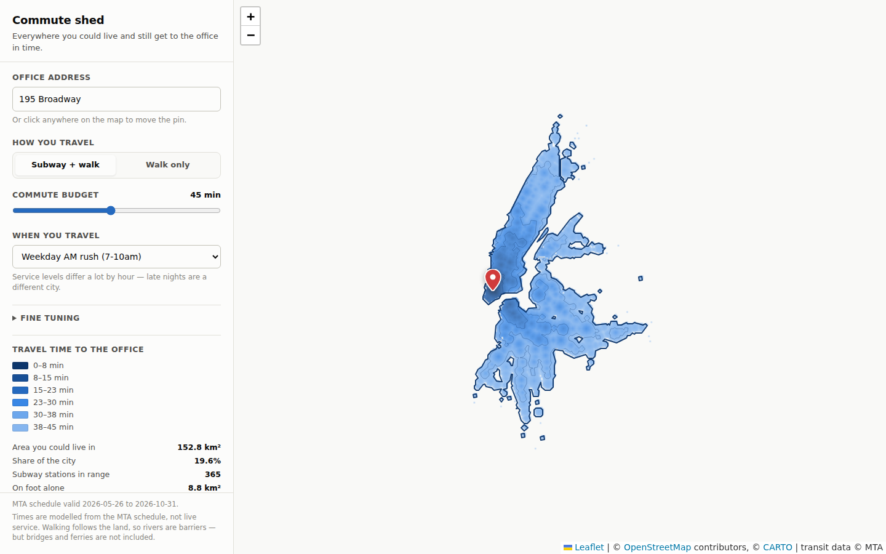

# NYC Commute Shed

Drop a pin on a New York office and the map fills in with everywhere you could
live and still get to work inside a given number of minutes — by subway and on
foot, or on foot alone.

It is a static web page. There is no server, no API key, and no network call at
runtime except map tiles and address lookup. The whole routing engine — a
subway graph and a 120-metre walking grid over the five boroughs — runs in a web
worker in about 30 milliseconds per query, so dragging the budget slider redraws
the city live.



## Running it

The data files are committed, so you only need a static server:

```sh
cd web && python3 -m http.server 8000
# then open http://localhost:8000
```

To rebuild the data from the current MTA feed:

```sh
pip install -r build/requirements.txt
./build/build_all.sh
```

That downloads the MTA subway GTFS feed and the borough boundaries, and writes
`web/data/transit-graph.json` (~280 KB) and `web/data/landmask.json` (~28 KB).

## What it actually computes

For a candidate home, the question is "how long does it take to get from *here*
to the office", so the search runs backwards from the office. This is not
pedantry: it puts the wait for the first train at the home end of the trip,
which is where a commuter actually waits.

Three passes, all in `web/js/worker.js`:

1. **Walk field.** Dijkstra across walkable grid cells outward from the office.
   Walking spreads over land, so it flows around the East River rather than
   across it, and "25 minutes on foot" traces the shoreline properly.
2. **Transit.** Dijkstra across the *reversed* subway graph, seeded with each
   station's walking time to the office. The result is, for every station, the
   time from that station to your desk.
3. **Spread out.** The walk field again, now also seeded with every station at
   its total time-to-office, capped by how far you would walk to your home
   station.

Each grid cell ends up holding the best of "walk the whole way" and "walk to a
station, ride, walk from a station".

### The subway graph

`build/build_transit_graph.py` turns the GTFS feed into a route-direction graph:

| Edge | From → to | Cost |
|---|---|---|
| ride | route node → route node | median run time between consecutive stops, for that route, direction and hour |
| board | station → route node | half the wait, plus half the station's in-complex transfer time |
| alight | route node → station | half the station's in-complex transfer time |
| transfer | station → station | the feed's out-of-complex transfer times |

Splitting the station's transfer time across boarding and alighting means a
same-complex transfer costs exactly the feed's `min_transfer_time` plus the wait
for the next train, while walking in off the street costs only half of it.

Everything is recomputed per time-of-day window — AM rush, midday, PM rush,
evening, late night, Saturday — so the late-night map really does carry
late-night headways and the different service patterns that come with them.

**Waiting is modelled on combined frequency.** Someone standing at Fulton St
takes the first of the 4 or 5; they do not wait out one route's headway. Routes
leaving the same platform toward the same next station therefore share a
headway. Routes that diverge immediately keep their own.

## What is not in it

Worth knowing before you trust a boundary:

- **Subway and Staten Island Railway only.** No buses, PATH, LIRR, Metro-North
  or ferries. Outer-borough neighbourhoods that lean on buses look worse than
  they are, and New Jersey and Westchester are out of scope entirely.
- **The five boroughs only.** The grid stops at the city line.
- **Scheduled service, not live.** Median run times from the published
  timetable. No delays, no track work, no weekend reroutes.
- **Walking does not cross water — including bridges.** Blocking the rivers is
  much more right than wrong at a 15-minute walking radius, but it does mean the
  Brooklyn Bridge walk is missing.
- **Walking distance is a grid metric, not street routing.** Eight-way movement
  across 120-metre cells, times an adjustable detour factor (1.25× by default).
- **Waiting is an average.** Half the headway, capped at 15 minutes. It does not
  know you check the app before leaving.

Times land a little conservative — they include getting down to the platform and
back up to the street — which is the direction you want when you are deciding
where to sign a lease.

## Exporting the boundary

The isochrone is traced with marching squares into real polygons, so it can
leave the app:

- **GeoJSON** — holes and detached pieces intact. Works in QGIS, Felt, Google
  My Maps, kepler.gl, most things.
- **KML** — for Google Earth and My Maps.
- **Copy points** — plain `lat, lon` per line.

### Using it on StreetEasy

StreetEasy's "draw your own boundary" tool is mouse-only — there is no import.
So the app hands you a boundary you can realistically trace by hand:

- Pick a **piece**. A commute shed is usually several disconnected shapes; with
  no bridges in the walking model, Manhattan and Brooklyn are separate
  landmasses. Draw each as its own StreetEasy boundary.
- Pick a **vertex count**, and the outline is simplified to fit it (binary
  search on the tolerance, so it keeps as much shape as the budget allows).
- Read the **fidelity line**, which says how much of the reachable area the
  outline holds and how much of what it encloses is actually over budget.
- **Show tracing view** numbers the corners in drawing order, over a map with
  street labels on top, so you can click them off one at a time.

There is also a URL-pattern field. `{polygon}` is substituted with
`lat,lon|lat,lon|…`. The default pattern is a guess — this repo has no verified
record of StreetEasy's URL format. Draw any boundary on StreetEasy, look at the
address bar, and paste that shape into the field to make the generated link
correct.

## Layout

```
build/     data pipeline (Python)
  build_transit_graph.py   GTFS  -> web/data/transit-graph.json
  build_landmask.py        boroughs -> web/data/landmask.json
  validate_graph.py        known commutes, checked against the built graph
  water_overrides.geojson  hand-drawn water the borough boundary includes
web/       the app (static, no build step)
  js/worker.js    routing engine
  js/contour.js   marching squares, ring nesting, simplification
  js/heatlayer.js canvas raster layer
  js/export.js    GeoJSON / KML / boundary helpers
  tests/          node web/tests/contour.test.mjs
```

## Tests

```sh
python3 build/validate_graph.py        # station-to-station times vs known trips
node web/tests/contour.test.mjs        # ring nesting, holes, winding, simplification
```

`validate_graph.py` is the one that catches a broken feed import: it checks
thirteen well-known trips (Coney Island to Times Sq, Bedford Av to Union Sq, and
so on) against hand-set ranges, and that the same trip is slower at night.

`build_landmask.py` self-checks too — it fails the build if a water override
swallows an inhabited neighbourhood, or if open water reads as land.

## Data

- Subway schedules: [MTA GTFS](https://www.mta.info/developers) — `gtfs_subway.zip`
- Borough boundaries: City of New York, via
  [click_that_hood](https://github.com/codeforgermany/click_that_hood)
- Basemap: [CARTO](https://carto.com/attributions) over
  [OpenStreetMap](https://www.openstreetmap.org/copyright)
- Geocoding: [NYC Planning GeoSearch](https://geosearch.planninglabs.nyc/),
  falling back to Nominatim
